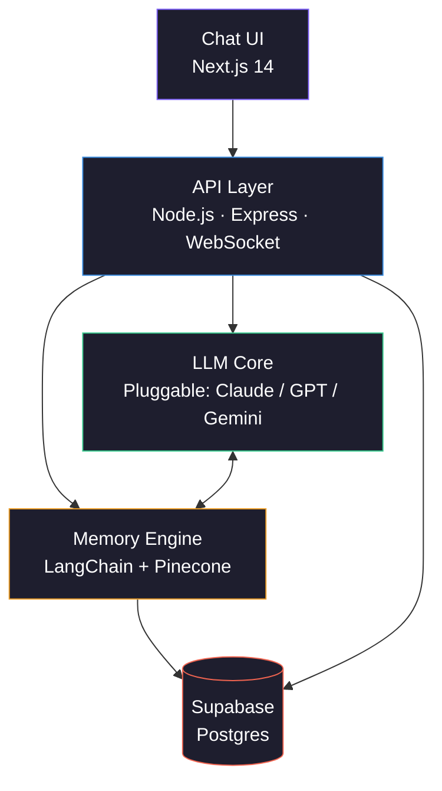

<div align="center">

# IMPLO

### *Improve. Reflect. Evolve.*

**An AI companion for therapy-informed self-reflection and personal growth.**

[](#)
[](#)
[](LICENSE)
[](#therapeutic-foundations)
[](#privacy-and-data-handling)

</div>

---

> [!IMPORTANT]
> **IMPLO is not a substitute for professional mental health care.** It is not a medical device, not a licensed therapist, and not appropriate for crisis situations. If you are in crisis or considering harming yourself, please contact your local emergency services or a crisis line — see [Crisis Resources](#crisis-resources).

---

## What is IMPLO?

Most AI assistants forget you the moment a conversation ends. IMPLO is built differently.

IMPLO maintains a continuous, evolving model of who you are — your moods, your goals, your patterns, your breakthroughs, and your setbacks. It draws on evidence-based therapeutic frameworks (CBT, ACT, DBT skills, motivational interviewing) to support reflection, habit-building, and personal growth between, or alongside, professional care.

Think of it less as "AI therapy" and more as a structured, always-available reflection partner that remembers context and helps you spot patterns in yourself over time.

---

## Who IMPLO is for — and who it isn't

**A good fit if you:**
- Want a structured space for journaling, reflection, and goal accountability
- Are already working with a therapist and want support between sessions
- Want help noticing patterns in your moods, habits, or thinking
- Are building skills around emotional regulation, focus, or behaviour change

**Not a fit if you:**
- Are in active crisis or experiencing thoughts of self-harm — please reach out to a human
- Need diagnosis, medication guidance, or treatment for a clinical condition
- Are looking for a replacement for licensed care

---

## Core features

| Feature | What it does |
|---|---|
| **Persistent memory** | Maintains context across sessions so you don't have to re-explain yourself every time |
| **Mood tracking** | Detects emotional shifts in your language and adapts tone; visualises trends over time |
| **Goal architecture** | Breaks long-horizon goals into actionable steps with gentle accountability |
| **Pattern recognition** | Surfaces recurring thought and behavioural patterns you might miss in the moment |
| **Reflection prompts** | Structured CBT/ACT-style exercises (thought records, values clarification, defusion) |
| **Privacy controls** | One-click export and full data deletion at any time |
| **Always available** | No appointments, no waitlists — useful at 2 a.m. when nothing else is open |

---

## Architecture



The model layer is intentionally pluggable. Different providers have different strengths in empathic dialogue, instruction following, and refusal behaviour around sensitive topics, and the right choice may change over time.

---

## Tech stack

| Layer | Technology | Purpose |
|---|---|---|
| Frontend | Next.js 14 + Tailwind CSS | UI, routing, accessibility |
| Backend | Node.js + Express | REST API + WebSocket sessions |
| LLM | Pluggable (Claude, GPT, Gemini) | Core dialogue model |
| Orchestration | LangChain | Prompt chains, tool routing, agent logic |
| Vector memory | Pinecone | Semantic recall across sessions |
| Database | Supabase (PostgreSQL) | Profiles, sessions, goals, mood logs |
| Auth | NextAuth.js | OAuth + email auth |
| Transport | TLS 1.3 | All client–server traffic |
| At-rest | AES-256 | User data encrypted in the database |

---

## Quick start

### Prerequisites

- Node.js `>= 18.0.0`
- A package manager (`npm`, `pnpm`, or `yarn`)
- Accounts: an LLM provider (Anthropic / OpenAI / Google), Supabase, Pinecone

### 1. Clone and install

```bash
git clone https://github.com/your-org/implo.git
cd implo
npm install
```

### 2. Configure environment

```bash
cp .env.example .env.local
```

Fill in `.env.local`:

```env
# LLM provider — set one
ANTHROPIC_API_KEY=sk-ant-...
# OPENAI_API_KEY=sk-...
# GOOGLE_API_KEY=...
LLM_PROVIDER=anthropic   # anthropic | openai | google

# Database
SUPABASE_URL=https://your-project.supabase.co
SUPABASE_ANON_KEY=your-anon-key
SUPABASE_SERVICE_ROLE_KEY=your-service-role-key

# Vector memory
PINECONE_API_KEY=your-pinecone-key
PINECONE_INDEX=implo-memory

# Auth
NEXTAUTH_SECRET=$(openssl rand -base64 32)
NEXTAUTH_URL=http://localhost:3000

# Encryption (32-byte key, base64-encoded)
ENCRYPTION_KEY=$(openssl rand -base64 32)
```

### 3. Set up the database

```bash
npx supabase db push
```

### 4. Run

```bash
npm run dev
```

Open [http://localhost:3000](http://localhost:3000).

---

## Project structure

```
implo/
├── app/                    # Next.js app router
│   ├── (auth)/             # Login & signup
│   ├── dashboard/          # Mood, habits, goal analytics
│   ├── session/            # Active conversation UI
│   └── api/                # Route handlers
├── components/             # Reusable UI
├── lib/
│   ├── ai/                 # LangChain chains, agents, providers
│   ├── memory/             # Pinecone read/write, summarisation
│   ├── therapy/            # CBT / ACT / DBT intervention modules
│   └── db/                 # Supabase client + queries
├── prompts/                # System prompts & templates
├── hooks/                  # Custom React hooks
├── types/                  # Shared TypeScript types
└── docs/                   # Extended documentation
```

---

## Therapeutic foundations

IMPLO's coaching engine draws from established, evidence-based frameworks:

- **CBT** — *Cognitive Behavioural Therapy.* Identifying and reframing distorted thoughts via thought records, Socratic questioning, and behavioural experiments.
- **ACT** — *Acceptance & Commitment Therapy.* Building psychological flexibility through values clarification, cognitive defusion, and committed action.
- **DBT skills** — *Dialectical Behaviour Therapy.* Distress tolerance, emotional regulation, and interpersonal effectiveness modules.
- **Motivational Interviewing** — Strengthening intrinsic motivation through reflective listening and change talk.
- **Positive Psychology** — Gratitude practices, character-strength identification, and savouring.

These are tools, not a replacement for the therapeutic relationship a human clinician provides. The product surface and prompts are reviewed periodically by qualified mental health professionals — see [docs/clinical-review.md](docs/clinical-review.md).

---

## Safety

Mental health is a high-stakes domain. IMPLO is designed with the following safety properties:

- **Crisis detection.** Mentions of self-harm, suicidal ideation, or harm to others trigger an immediate handoff: the model surfaces local crisis resources and gently encourages contact with a human professional. It does not attempt to "talk through" a crisis on its own.
- **Boundaries on diagnosis.** IMPLO will not diagnose, prescribe, or interpret medical history. It will name patterns and suggest the user discuss them with a qualified clinician.
- **Conservative defaults on sensitive topics.** Substances, eating, trauma, and grief are handled with care; the system errs toward shorter, supportive responses and resource referrals over speculation.
- **No reinforcement of harmful patterns.** Prompts are explicitly tuned away from sycophancy and from validating self-destructive narratives.
- **Audit logs.** All safety-classifier decisions are logged for review and continuous improvement.

If you find behaviour that worries you, please [open an issue](https://github.com/your-org/implo/issues/new?template=safety.md) marked with the `safety` label. We triage these before feature work.

---

## Privacy and data handling

Honest framing matters here, so plain language:

- **In transit:** All traffic uses TLS 1.3.
- **At rest:** Session content is encrypted with AES-256 in our database.
- **Third-party processing:** Your messages are sent to your configured LLM provider for inference. This means *true end-to-end encryption is not possible* — the model has to see plaintext to respond. We treat provider choice and provider data policies as a first-class concern: by default, IMPLO uses providers and endpoints that contractually do not retain your data or train on it.
- **Training:** We do not use your session data to train models. Ever.
- **Your data, your choice:** Export and delete are available in settings and take effect immediately.
- **Regulatory posture:** GDPR and POPIA aligned. HIPAA is *not* claimed by default — a HIPAA-aligned deployment requires a specific configuration and a Business Associate Agreement with your LLM provider, documented in [docs/hipaa.md](docs/hipaa.md).

Full details: [Privacy Policy](docs/privacy.md) · [Ethics Charter](docs/ethics.md) · [Data flow diagram](docs/data-flow.md).

---

## Crisis resources

If you or someone you know is in crisis, please reach out to a human now:

- **South Africa** — SADAG 24-hour helpline: `0800 567 567` · SMS `31393`
- **United States** — 988 Suicide & Crisis Lifeline: dial or text `988`
- **United Kingdom** — Samaritans: `116 123`
- **International** — [findahelpline.com](https://findahelpline.com)

If there is immediate danger to life, contact your local emergency services.

---

## Roadmap

- [x] Conversational core with session context
- [x] Persistent memory via vector store
- [x] Mood tracking and journaling
- [x] Goal setting and accountability
- [ ] **v1.1** — Mobile app (React Native)
- [ ] **v1.2** — Voice mode (speech-to-text + TTS)
- [ ] **v1.3** — Weekly insight reports (PDF export)
- [ ] **v1.4** — Optional, opt-in *handoff packets* a user can share with their clinician (not a clinical handoff system)
- [ ] **v2.0** — Wearable data integration (sleep, HRV, steps)

Multimodal face/tone analysis is **explicitly off the roadmap** until we are confident it can be done without harm.

---

## Contributing

We welcome contributors who share the goal of building technology that genuinely helps people.

```bash
git checkout -b feature/your-feature-name
git commit -m "feat: short description"
git push origin feature/your-feature-name
# Open a Pull Request
```

Before contributing, please read [CONTRIBUTING.md](CONTRIBUTING.md) and our [Code of Conduct](CODE_OF_CONDUCT.md). Contributions touching prompts, safety classifiers, or therapeutic content require review by a clinical advisor before merge.

---

## Acknowledgements

IMPLO stands on the shoulders of decades of clinical research and the open-source ecosystem. Particular gratitude to the developers of LangChain, Supabase, Pinecone, and Next.js, and to the clinical psychologists whose published work informs the intervention modules.

---

## License

MIT — see [LICENSE](LICENSE).

---

<div align="center">

**IMPLO** · Improve. Reflect. Evolve.

[Website](https://implo.ai) · [Docs](https://docs.implo.ai) · [Discord](https://discord.gg/implo) · [Twitter](https://twitter.com/implo_ai)

<br/>

> *"The curious paradox is that when I accept myself just as I am, then I can change."*
> — Carl R. Rogers

</div>
